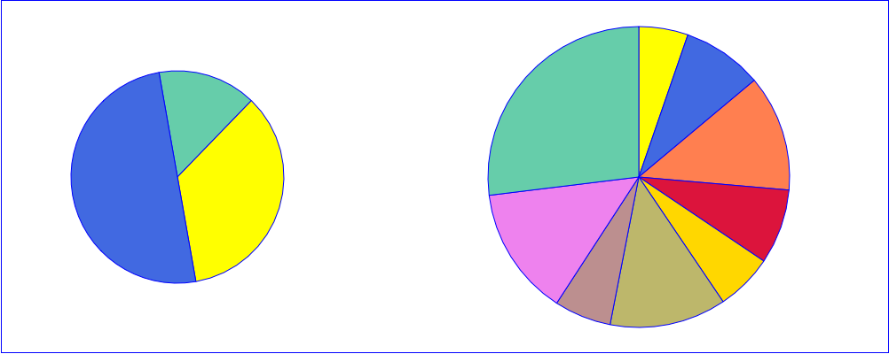
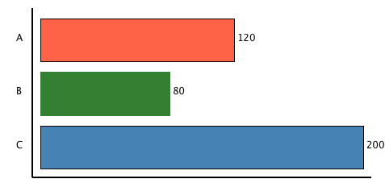
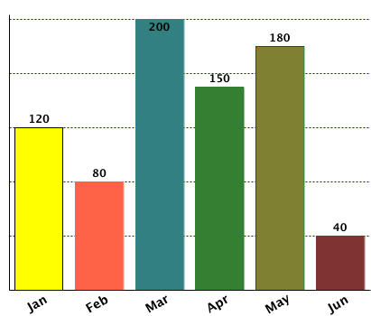
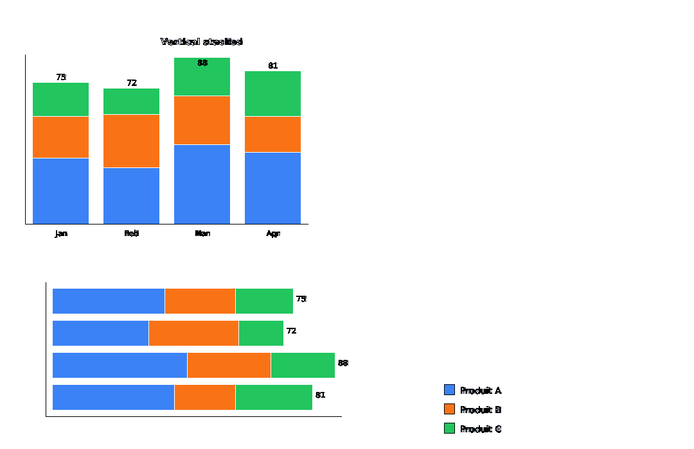
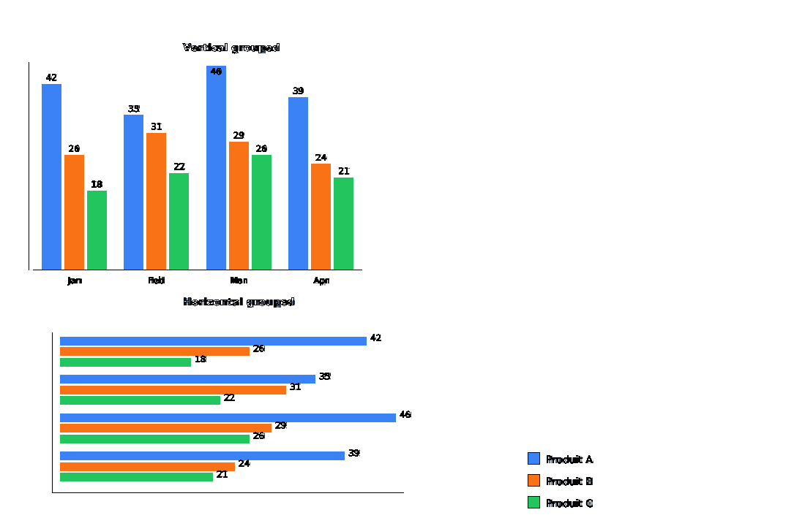

## chart

This class generates SVG graphics.

## Summary

This class extends the <a href="svg.md">`svg`</a>class

### ⚠️ Work in progress

|Function|Action|
|--------|------|
|.**pie** ( id :`Text` ; cx : `Real` ; cy : `Real` ; r : `Real` {; options : `Object`}) → `cs.chart` | Start a pie chart defined by its center `cx` `cy` and radius `r`. If `options.data` is empty or its total is `<= 0`, the function sets an explicit error and returns without drawing.|
|.**pieBounded** ( id :`Text` ; x : `Real` ; y : `Real` ; width : `Real` {; options : `Object`}) → `cs.chart` | Start a pie chart that fits into a square defined by the upper left corner `x` `y` and the side length `width`.|
|.**donut** ( id :`Text` ; cx : `Real` ; cy : `Real` ; r : `Real` {; thickness : `Real` {; margin : `Real` {; options : `Object`}}}) → `cs.chart` |  Start a donut chart defined by its center `cx` `cy`, radius `r`. `thickness` is stored as an inner radius percentage (0..100). If `<1`, it is interpreted as a ratio and converted to percent. Default is `0.7` (inner radius = 70% of radius, ring thickness = 30%). `margin` defines segment spacing. `options.span` can limit the donut to an arc in degrees (default `360`).| 
|.**donutBounded** ( id :`Text` ; x : `Real` ; y : `Real` ; width : `Real` ; options : `Object` ) → `cs.chart` |  Start a donut chart that fits into a square defined by the upper left corner `x` `y` and the side length `width`. Same `thickness`/`margin` behavior as `.donut()`.|
|.**semiDonut** ( id :`Text` ; cx : `Real` ; cy : `Real` ; r : `Real` {; thickness : `Real` {; margin : `Real` {; options : `Object`}}}) → `cs.chart` | Start a semi-donut chart (`span = 180`). Default origin is `-90` (top half).|
|.**semiDonutBounded** ( id :`Text` ; x : `Real` ; y : `Real` ; width : `Real` {; thickness : `Real` {; margin : `Real` {; options : `Object`}}}) → `cs.chart` | Start a semi-donut chart that fits into a square.|
|.**progressRing** ( id :`Text` ; cx : `Real` ; cy : `Real` ; r : `Real` ; value : `Real` ; max : `Real` {; options : `Object`} ) → `cs.chart` | Draws a single-value donut chart (progress ring). The ring is clamped to 0..100%. Supports track color, value color, origin, thickness, optional center label and font via options.|
|.**circularGauge** ( id :`Text` ; cx : `Real` ; cy : `Real` ; r : `Real` ; value : `Real` ; max : `Real` {; options : `Object`} ) → `cs.chart` | Draws a circular gauge with colored zones, a needle and optional value/min/max labels.|
|.**wedge**( id :`Text` ; percent : `Real`) → `cs.chart`|Draws a segment of the 360° percentage in a pie or donut chart. If the chart id is not found, an explicit error is pushed (`wedge(): chart id not found: ...`).|
|.**horizontlBar** ( id :`Text` ; x : `Real` ; y : `Real` ; width : `Real` ; height : `Real` {; options : `Object`}) → `cs.chart` | Start a vertical bar chart. `options.data` must be a collection of objects `{label, value, [color]}`.|
|.**verticalBar** ( id :`Text` ; x : `Real` ; y : `Real` ; width : `Real` ; height : `Real` {; options : `Object`}) → `cs.chart` | Start a vertical bar chart. `options.data` must be a collection of objects `{label, value, [color]}`.|
|.**horizontalStackedBar** ( id :`Text` ; x : `Real` ; y : `Real` ; width : `Real` ; height : `Real` {; options : `Object`}) → `cs.chart` | Start a horizontal stacked bar chart. `options.data` must be `{label; segments:[{value; [color]}...]}`.|
|.**verticalStackedBar** ( id :`Text` ; x : `Real` ; y : `Real` ; width : `Real` ; height : `Real` {; options : `Object`}) → `cs.chart` | Start a vertical stacked bar chart. `options.data` must be `{label; segments:[{value; [color]}...]}`.|
|.**verticalLollipop** ( id :`Text` ; x : `Real` ; y : `Real` ; width : `Real` ; height : `Real` {; options : `Object`}) → `cs.chart` | Draws a vertical lollipop chart (thin lines with circles). `options.data` must be a collection of objects `{label, value, [color]}`. Supports `circleRadius` (default 4), `showLabels`, `showValues`.|
|.**horizontalLollipop** ( id :`Text` ; x : `Real` ; y : `Real` ; width : `Real` ; height : `Real` {; options : `Object`}) → `cs.chart` | Draws a horizontal lollipop chart. Same data structure and options as `verticalLollipop`.|
|.**heatmap** ( id :`Text` ; x : `Real` ; y : `Real` ; width : `Real` ; height : `Real` {; options : `Object`}) → `cs.chart` | Draws a heatmap (matrix of colored cells). `options.data` must be a 2D array (collection of collections). Supports `colors` (palette), `showValues`, `rowLabels`, `colLabels`, `showRowLabels`, `showColLabels`.|
|.**verticalWaterfall** ( id :`Text` ; x : `Real` ; y : `Real` ; width : `Real` ; height : `Real` {; options : `Object`}) → `cs.chart` | Draws a vertical waterfall chart for cumulative analysis. `options.data` must be `{label, value, [isTotal], [color]}`. Supports `showLabels`, `showValues`, `axis` options.|
|.**horizontalWaterfall** ( id :`Text` ; x : `Real` ; y : `Real` ; width : `Real` ; height : `Real` {; options : `Object`}) → `cs.chart` | Draws a horizontal waterfall chart. Same data structure and options as `verticalWaterfall`.|
|.**radar** ( id :`Text` ; cx : `Real` ; cy : `Real` ; r : `Real` {; options : `Object`}) → `cs.chart` | Draws a radar/spider chart for multi-criteria evaluation. `options.data` must be `{labels: [...], series: [{label, values: [...]}]}`. Supports `max` (scale), `levels` (grid rings), `showLegend`.|
|.**sparkline** ( id :`Text` ; x : `Real` ; y : `Real` ; width : `Real` ; height : `Real` {; options : `Object`}) → `cs.chart` | Draws a mini line chart (sparkline) for KPI cards. `options.data` must be a collection of numbers. Supports `color`, `strokeWidth`, `fill` (boolean), and `fillColor` for optional area fill.|
|.**closeChart**({id :`Text`})| Closing the chart `id` or the current chart|

### Notes

- In `.pie()`, non-positive values are ignored while filling slices.
- Error reporting favors explicit `_pushError(...)` messages instead of debug traces.
- For partial rings, percentages in `.wedge()` are relative to `options.span` (not always 360°).

## Examples

See the ***HDI Chart xxx*** methods

|  |  |
|:----|:----:|
|**Pie**||
|**Donut**||
|**progressRing**||

### Horizontal bar
```4D
var $chart:=cs:C1710.chart.new()
$chart.horizontalBar("myHBar"; 10; 10; 400; 200; {\
	data: [\
		{label: "A"; value: 120; color: "tomato"}; \
		{label: "B"; value: 80}; \
		{label: "C"; value: 200; color: "steelblue"}\
	]; \
	barGap: 0.2; \
	showValues: True; \
	axis: True \
})
$chart.preview()
```
<br>


----

### Vertical bar

```4D
var $chart:=cs:C1710.svgx.chart.new()
$chart.verticalBar("demo_vertical_bar"; 10; 10; 400; 300; {\
data: [\
{label: "Jan"; value: 120; color: "yellow"; stroke: True}; \
{label: "Feb"; value: 80; color: "tomato"}; \
{label: "Mar"; value: 200}; \
{label: "Apr"; value: 150}; \
{label: "May"; value: 180; stroke: "darkgreen"}; \
{label: "Jun"; value: 40}\
]; \
gap: 0.2; \
showValues: True; \
font: {style: Bold}; \
labels: {angle: -30; font: {size: 14; style: Bold}}; \
axis: True; \
horizontalGridLines: {unit: 40; color: "blue"}\
})
$chart.preview()
```
<br>


----

### Stacked bars

```4D
var $chart:=cs.svgx.chart.new()

$chart.newCanvas({width: 1080; height: 700; viewBox: "0 0 1080 700"})

$chart.text("HDI Chart: stackedBar").position(40; 30).fontSize(18).fontStyle(Bold).fillColor("#1d3557")

var $data:=[\
{label: "Jan"; segments: [\
{value: 35; color: "#3b82f6"}; \
{value: 22; color: "#f97316"}; \
{value: 18; color: "#22c55e"}\
]}; \
{label: "Feb"; segments: [\
{value: 30; color: "#3b82f6"}; \
{value: 28; color: "#f97316"}; \
{value: 14; color: "#22c55e"}\
]}; \
{label: "Mar"; segments: [\
{value: 42; color: "#3b82f6"}; \
{value: 26; color: "#f97316"}; \
{value: 20; color: "#22c55e"}\
]}; \
{label: "Apr"; segments: [\
{value: 38; color: "#3b82f6"}; \
{value: 19; color: "#f97316"}; \
{value: 24; color: "#22c55e"}\
]}\
]

$chart.text("Vertical stacked").position(250; 70).fontSize(14).fontStyle(Bold).fillColor("#334155")
$chart.verticalStackedBar("vstack"; 40; 90; 440; 260; {\
data: $data; \
showLabels: True; \
showValues: True; \
axis: True; \
stroke: "white"\
})

$chart.text("Horizontal stacked").position(250; 420).fontSize(14).fontStyle(Bold).fillColor("#334155")
$chart.horizontalStackedBar("hstack"; 40; 440; 440; 200; {\
data: $data; \
showLabels: True; \
showValues: True; \
axis: True; \
stroke: "white"\
})

// Legend
$chart.rect(16; 16).position(620; 160).fill("#3b82f6")
$chart.text("Produit A").position(644; 174).fontSize(14).fillColor("#334155")
$chart.rect(16; 16).position(620; 190).fill("#f97316")
$chart.text("Produit B").position(644; 204).fontSize(14).fillColor("#334155")
$chart.rect(16; 16).position(620; 220).fill("#22c55e")
$chart.text("Produit C").position(644; 234).fontSize(14).fillColor("#334155")

$chart.preview()
```

<br>


----

### Grouped bars

```4D
var $chart:=cs.svgx.chart.new()

$chart.newCanvas({width: 1100; height: 720; viewBox: "0 0 1100 720"})

$chart.text("HDI Chart: groupedBar").position(40; 30).fontSize(18).fontStyle(Bold).fillColor("#1d3557")
$chart.text("Vertical grouped").position(250; 70).fontSize(14).fontStyle(Bold).fillColor("#334155")
$chart.text("Horizontal grouped").position(250; 418).fontSize(14).fontStyle(Bold).fillColor("#334155")

var $data:=[\
{label: "Jan"; groups: [\
{value: 42; color: "#3b82f6"; name: "Produit A"}; \
{value: 26; color: "#f97316"; name: "Produit B"}; \
{value: 18; color: "#22c55e"; name: "Produit C"}\
]}; \
{label: "Feb"; groups: [\
{value: 35; color: "#3b82f6"; name: "Produit A"}; \
{value: 31; color: "#f97316"; name: "Produit B"}; \
{value: 22; color: "#22c55e"; name: "Produit C"}\
]}; \
{label: "Mar"; groups: [\
{value: 46; color: "#3b82f6"; name: "Produit A"}; \
{value: 29; color: "#f97316"; name: "Produit B"}; \
{value: 26; color: "#22c55e"; name: "Produit C"}\
]}; \
{label: "Apr"; groups: [\
{value: 39; color: "#3b82f6"; name: "Produit A"}; \
{value: 24; color: "#f97316"; name: "Produit B"}; \
{value: 21; color: "#22c55e"; name: "Produit C"}\
]}\
]

$chart.verticalGroupedBar("vgroup"; 40; 90; 460; 280; {\
data: $data; \
showLabels: True; \
showValues: True; \
axis: True; \
stroke: "white"\
})

$chart.horizontalGroupedBar("hgroup"; 40; 450; 460; 220; {\
data: $data; \
showLabels: True; \
showValues: True; \
axis: True; \
stroke: "white"\
})

// Legend
$chart.rect(16; 16).position(650; 170).fill("#3b82f6")
$chart.text("Produit A").position(674; 184).fontSize(14).fillColor("#334155")
$chart.rect(16; 16).position(650; 200).fill("#f97316")
$chart.text("Produit B").position(674; 214).fontSize(14).fillColor("#334155")
$chart.rect(16; 16).position(650; 230).fill("#22c55e")
$chart.text("Produit C").position(674; 244).fontSize(14).fillColor("#334155")

$chart.preview()
```
<br>


----

### Semi donut

```4D
var $chart:=cs.svgx.chart.new()

$chart.newCanvas({width: 680; height: 760; viewBox: "0 0 680 760"})

$chart.text("Répartition de la facture")\
.position(340; 52)\
.setAttribute("text-anchor"; "middle")\
.fontSize(44)\
.fontStyle(Bold)\
.fillColor("#163a7a")

var $thickness : Real:=0.62
var $margin : Integer:=2
var $radius : Real:=120

var $pink : Text:="#e63772"
var $green : Text:="#4f8b00"
var $orange : Text:="#f17d1f"
var $blue : Text:="#1271d5"

// 2025
$chart.semiDonut("bill_2025"; 190; 255; $radius; $thickness; $margin; {origin: -90})
$chart.wedge("bill_2025"; 34).fill($pink)
$chart.wedge("bill_2025"; 54).fill($green)
$chart.wedge("bill_2025"; 7).fill($orange)
$chart.wedge("bill_2025"; 5).fill($blue)
$chart.text("256 €").position(190; 125).setAttribute("text-anchor"; "middle").fontSize(40).fontStyle(Bold).fillColor("#2c4f95")
$chart.text("2025").position(190; 325).setAttribute("text-anchor"; "middle").fontSize(34).fontStyle(Bold).fillColor("#2c4f95")

// 2024
$chart.semiDonut("bill_2024"; 490; 255; $radius; $thickness; $margin; {origin: -90})
$chart.wedge("bill_2024"; 33).fill($pink)
$chart.wedge("bill_2024"; 56).fill($green)
$chart.wedge("bill_2024"; 6).fill($orange)
$chart.wedge("bill_2024"; 5).fill($blue)
$chart.text("247 €").position(490; 125).setAttribute("text-anchor"; "middle").fontSize(40).fontStyle(Bold).fillColor("#2c4f95")
$chart.text("2024").position(490; 325).setAttribute("text-anchor"; "middle").fontSize(34).fontStyle(Bold).fillColor("#2c4f95")

// 2023
$chart.semiDonut("bill_2023"; 340; 490; $radius; $thickness; $margin; {origin: -90})
$chart.wedge("bill_2023"; 35).fill($pink)
$chart.wedge("bill_2023"; 53).fill($green)
$chart.wedge("bill_2023"; 6).fill($orange)
$chart.wedge("bill_2023"; 6).fill($blue)
$chart.text("249 €").position(340; 360).setAttribute("text-anchor"; "middle").fontSize(40).fontStyle(Bold).fillColor("#2c4f95")
$chart.text("2023").position(340; 560).setAttribute("text-anchor"; "middle").fontSize(34).fontStyle(Bold).fillColor("#2c4f95")

// Legend line 1
$chart.rect(20; 20).position(160; 625).fill($pink)
$chart.text("Conso energie HT").position(190; 642).fontSize(18).fillColor("#1f376e")
$chart.rect(20; 20).position(370; 625).fill($green)
$chart.text("Abonnement HT").position(400; 642).fontSize(18).fillColor("#1f376e")

// Legend line 2
$chart.rect(20; 20).position(220; 680).fill($orange)
$chart.text("Taxe hors TVA").position(250; 697).fontSize(18).fillColor("#1f376e")
$chart.rect(20; 20).position(420; 680).fill($blue)
$chart.text("TVA").position(450; 697).fontSize(18).fillColor("#1f376e")

$chart.preview()
```
<br>


----

### Circular gauge

```4D
var $chart:=cs:C1710.svgx.chart.new()

$chart.newCanvas({width: 420; height: 280; viewBox: "0 0 420 280"})

$chart.circularGauge("g1"; 210; 150; 110; 72; 100; {\
	span: 180; \
	origin: -90; \
	thickness: 0.72; \
	unit: "%"; \
	zones: [\
		{limit: 60; color: "#22a06b"}; \
		{limit: 85; color: "#ff8b00"}; \
		{limit: 100; color: "#d7263d"}\
	]\
})

$chart.preview()
```
<br>


----

### Sparkline

```4D
var $chart:=cs:C1710.svgx.chart.new()

$chart.newCanvas({width: 800; height: 500; viewBox: "0 0 800 500"})

$chart.text("Sparklines - KPI Metrics").position(400; 40).setAttribute("text-anchor"; "middle").fontSize(36).fontStyle(Bold).fillColor("#163a7a")

// Sample data sets for sparklines
var $data1 : Collection:=[12; 19; 8; 15; 22; 17; 25; 20; 18; 24; 21]
var $data2 : Collection:=[45; 38; 42; 35; 48; 50; 43; 46; 44; 52; 55]
var $data3 : Collection:=[8; 12; 6; 14; 10; 16; 9; 13; 11; 15; 12]
var $data4 : Collection:=[100; 95; 105; 98; 110; 108; 115; 112; 118; 120; 125]

// Row 1: Sales & Revenue
$chart.text("Sales").position(50; 110).fontSize(18).fontStyle(Bold).fillColor("#333")
$chart.sparkline("spark_sales"; 50; 130; 300; 60; {data: $data1; color: "#2196F3"; fill: True})

$chart.text("Revenue").position(450; 110).fontSize(18).fontStyle(Bold).fillColor("#333")
$chart.sparkline("spark_revenue"; 450; 130; 300; 60; {data: $data2; color: "#4CAF50"; fill: True})

// Row 2: Traffic & Users
$chart.text("Traffic").position(50; 260).fontSize(18).fontStyle(Bold).fillColor("#333")
$chart.sparkline("spark_traffic"; 50; 280; 300; 60; {data: $data3; color: "#FF9800"; fill: True})

$chart.text("Users").position(450; 260).fontSize(18).fontStyle(Bold).fillColor("#333")
$chart.sparkline("spark_users"; 450; 280; 300; 60; {data: $data4; color: "#E91E63"; fill: True})

$chart.preview()
```
<br>


----

### Lollipop

```4D
var $chart:=cs:C1710.svgx.chart.new()

$chart.newCanvas({width: 800; height: 600; viewBox: "0 0 800 600"})

$chart.text("Lollipop Charts - Elegant Data Visualization").position(400; 40).setAttribute("text-anchor"; "middle").fontSize(28).fontStyle(Bold).fillColor("#163a7a")

// Vertical Lollipop Chart
$chart.text("Sales by Quarter (Vertical)").position(200; 100).fontSize(16).fontStyle(Bold).fillColor("#333")

var $vdata : Collection:=[\
{label: "Q1"; value: 45}; \
{label: "Q2"; value: 52}; \
{label: "Q3"; value: 38}; \
{label: "Q4"; value: 61}\
]

$chart.verticalLollipop("vlollipop"; 50; 130; 300; 200; {\
data: $vdata; \
showLabels: True; \
showValues: True; \
axis: True; \
circleRadius: 5; \
max: 70\
})

// Horizontal Lollipop Chart
$chart.text("Department Performance (Horizontal)").position(150; 400).fontSize(16).fontStyle(Bold).fillColor("#333")

var $hdata : Collection:=[\
{label: "Engineering"; value: 92}; \
{label: "Sales"; value: 78}; \
{label: "Marketing"; value: 85}; \
{label: "Support"; value: 88}; \
{label: "Operations"; value: 72}\
]

$chart.horizontalLollipop("hlollipop"; 150; 420; 400; 150; {\
data: $hdata; \
showLabels: True; \
showValues: True; \
axis: True; \
circleRadius: 6; \
max: 100\
})

$chart.preview()
```
<br>


----

### Heatmap

```4D
var $chart:=cs:C1710.svgx.chart.new()

$chart.newCanvas({width: 900; height: 650; viewBox: "0 0 900 650"})

$chart.text("Heatmap Charts - Matrix Visualization").position(450; 40).setAttribute("text-anchor"; "middle").fontSize(36).fontStyle(Bold).fillColor("#163a7a")

// Sample heatmap data (5x7 matrix)
var $heatmapData : Collection:=[[\
12; 19; 8; 15; 22; 17; 25]; \
[45; 38; 42; 35; 48; 50; 43]; \
[8; 12; 6; 14; 10; 16; 9]; \
[100; 95; 105; 98; 110; 108; 115]; \
[25; 30; 28; 32; 35; 33; 38]\
]

var $rowLabels : Collection:=["Week 1"; "Week 2"; "Week 3"; "Week 4"; "Week 5"]
var $colLabels : Collection:=["Mon"; "Tue"; "Wed"; "Thu"; "Fri"; "Sat"; "Sun"]

$chart.text("Website Traffic by Day").position(120; 100).fontSize(16).fontStyle(Bold).fillColor("#333")

$chart.heatmap("hmap1"; 100; 130; 280; 200; {\
data: $heatmapData; \
rowLabels: $rowLabels; \
colLabels: $colLabels; \
showRowLabels: True; \
showColLabels: True; \
showValues: True; \
colors: ["#0571B0"; "#2E8BC0"; "#92C5DE"; "#F7F7F7"; "#F4A582"; "#E08214"; "#B35806"]\
})

// Second heatmap with different color scheme
$chart.text("Temperature Distribution").position(520; 100).fontSize(16).fontStyle(Bold).fillColor("#333")

var $tempData : Collection:=[[\
15; 16; 17; 18; 19; 20; 21]; \
[14; 15; 16; 17; 18; 19; 20]; \
[12; 13; 14; 15; 16; 17; 18]; \
[10; 11; 12; 13; 14; 15; 16]; \
[8; 9; 10; 11; 12; 13; 14]\
]

$chart.heatmap("hmap2"; 500; 130; 280; 200; {\
data: $tempData; \
rowLabels: $rowLabels; \
colLabels: $colLabels; \
showRowLabels: True; \
showColLabels: True; \
showValues: True; \
colors: ["#1A237E"; "#283593"; "#3F51B5"; "#7986CB"; "#FFEB3B"; "#FFA726"; "#D84315"]\
})

$chart.preview()
```
<br>


----

### Radar

```4D
var $chart:=cs:C1710.svgx.chart.new()

$chart.newCanvas({width: 1000; height: 550; viewBox: "0 0 1000 550"})

$chart.text("Radar Charts - Multi-Criteria Evaluation").position(500; 40).setAttribute("text-anchor"; "middle").fontSize(36).fontStyle(Bold).fillColor("#163a7a")

// Employee Evaluation Radar
$chart.text("Employee Skills Assessment").position(250; 100).setAttribute("text-anchor"; "middle").fontSize(16).fontStyle(Bold).fillColor("#333")

var $skillLabels : Collection:=["Technical"; "Communication"; "Leadership"; "Problem-Solving"; "Teamwork"; "Creativity"]

var $radarData1 : Object:={\
	labels: $skillLabels; \
	series: [\
		{label: "Alice"; values: [9; 8; 7; 9; 8; 7]; color: "#FF6B6B"}; \
		{label: "Bob"; values: [7; 9; 8; 7; 9; 8]; color: "#4ECDC4"}; \
		{label: "Charlie"; values: [8; 7; 9; 8; 7; 9]; color: "#45B7D1"}\
		]\
	}

$chart.radar("radar1"; 250; 280; 150; {data: $radarData1; max: 10; levels: 5; showLegend: False})

// Product Comparison Radar
$chart.text("Product Feature Comparison").position(750; 100).setAttribute("text-anchor"; "middle").fontSize(16).fontStyle(Bold).fillColor("#333")

var $featureLabels : Collection:=["Performance"; "Design"; "Usability"; "Support"; "Price"; "Reliability"]

var $radarData2 : Object:={\
	labels: $featureLabels; \
	series: [\
		{label: "Product A"; values: [8; 7; 9; 6; 5; 9]; color: "#FFD93D"}; \
		{label: "Product B"; values: [7; 9; 7; 8; 8; 7]; color: "#6BCB77"}; \
		{label: "Product C"; values: [9; 8; 8; 9; 7; 8]; color: "#4D96FF"}\
		]\
	}

$chart.radar("radar2"; 750; 280; 150; {data: $radarData2; max: 10; levels: 5; showLegend: True; legendGap: 20})

$chart.preview()
```
<br>


----

### Waterfall

```4D
var $chart:=cs:C1710.svgx.chart.new()

$chart.newCanvas({width: 900; height: 650; viewBox: "0 0 900 650"})

$chart.text("Waterfall Charts - Cumulative Analysis").position(450; 40).setAttribute("text-anchor"; "middle").fontSize(36).fontStyle(Bold).fillColor("#163a7a")

// Vertical Waterfall - Financial Analysis
$chart.text("2024 Profit Analysis (Vertical)").position(180; 100).fontSize(16).fontStyle(Bold).fillColor("#333")

var $vwaterfallData : Collection:=[\
{label: "Start"; value: 0; isTotal: True; color: "#1f2937"}; \
{label: "Revenue"; value: 150}; \
{label: "COGS"; value: -60}; \
{label: "OpEx"; value: -25}; \
{label: "Tax"; value: -15}; \
{label: "Final"; value: 50; isTotal: True; color: "#1f2937"}\
]

$chart.verticalWaterfall("vwf"; 50; 130; 300; 280; {\
data: $vwaterfallData; \
showLabels: True; \
showValues: True; \
axis: True; \
padding: 12\
})

// Horizontal Waterfall - Performance Breakdown
$chart.text("Q4 Performance Breakdown (Horizontal)").position(500; 100).fontSize(16).fontStyle(Bold).fillColor("#333")

var $hwaterfallData : Collection:=[\
{label: "Target"; value: 100; isTotal: True; color: "#1f2937"}; \
{label: "Base Sales"; value: 120}; \
{label: "Discounts"; value: -15}; \
{label: "Returns"; value: -8}; \
{label: "Bonus Sales"; value: 25}; \
{label: "Actual"; value: 122; isTotal: True; color: "#1f2937"}\
]

$chart.horizontalWaterfall("hwf"; 520; 150; 330; 220; {\
data: $hwaterfallData; \
showLabels: True; \
showValues: True; \
axis: True; \
padding: 15\
})

$chart.preview()
```
<br>


----
