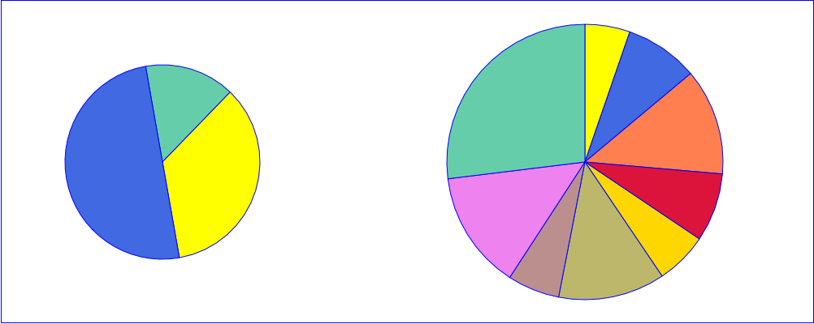
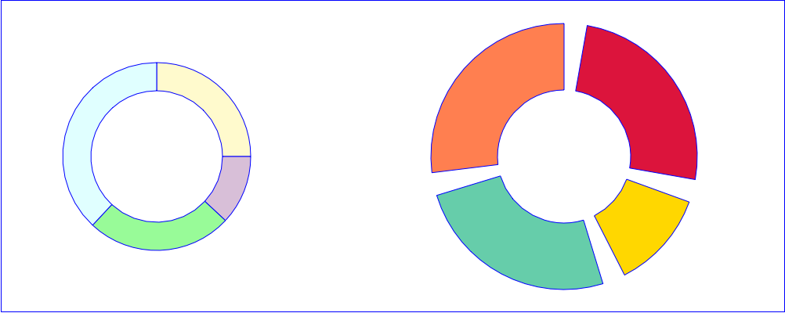

## chart

This class generates SVG graphics.

## Summary

This class extends the <a href="svg.md">`svg`</a>class

### ⚠️ Work in progress

|Function|Action|
|--------|------|
|.**pie** ( id :`Text` ; cx : `Real` ; cy : `Real` ; r : `Real` {; options : `Object`}) → `cs.chart` | Start a pie chart defined by its center `cx` `cy` and radius `r`.|
|.**pieBounded** ( id :`Text` ; x : `Real` ; y : `Real` ; width : `Real` {; options : `Object`}) → `cs.chart` | Start a pie chart that fits into a square defined by the upper left corner `x` `y` and the side length `width`.|
|.**donut** ( id :`Text` ; cx : `Real` ; cy : `Real` ; r : `Real` {; thickness : `Real` {; margin : `Real` {; options : `Object`}}}) → `cs.chart` |  Start a donut chart defined by its center `cx` `cy`, radius `r`. `tickness` define from 0 to 100 the height of te segments relative to the radius, `margin` their spacing.|
|.**donutBounded** ( id :`Text` ; x : `Real` ; y : `Real` ; width : `Real` ; options : `Object` ) → `cs.chart` |  Start a donut chart that fits into a square defined by the upper left corner `x` `y` and the side length `width`. `tickness` define from 0 to 100 the height of te segments relative to the radius, `margin` their spacing.|
|.**wedge**( id :`Text` ; percent : `Real`) → `cs.chart`|Draws a segment of the 360° percentage in a pie or donut chart.|
|.**horizontlBar** ( id :`Text` ; x : `Real` ; y : `Real` ; width : `Real` ; height : `Real` {; options : `Object`}) → `cs.chart` | Start a vertical bar chart. `options.data` must be a collection of objects `{label, value, [color]}`.|
|.**verticalBar** ( id :`Text` ; x : `Real` ; y : `Real` ; width : `Real` ; height : `Real` {; options : `Object`}) → `cs.chart` | Start a vertical bar chart. `options.data` must be a collection of objects `{label, value, [color]}`.|
|.**closeChart**({id :`Text`})| Closing the chart `id` or the current chart|

## Examples

See the ***HDI Chart xxx*** methods

|  |  |
|:----|:----:|
|**Pie**||
|**Donut**||

### Horizontal bar
```4D
var $chart:=cs:C1710.chart.new()
$chart.horizontalBar("myHBar"; 10; 10; 400; 200; {\
	data: [\
		{label: "A"; value: 120; color: "tomato"}; \
		{label: "B"; value: 80}; \
		{label: "C"; value: 200; color: "steelblue"}\
	]; \
	barGap: 0.2; \
	showValues: True; \
	axis: True \
})
$chart.preview()
```


### Vertical bar

```4D
var $chart:=cs.svgx.chart.new()
$chart.verticalBar("demo_vertical_bar"; 10; 10; 400; 300; {\
data: [\
{label: "Jan"; value: 120; color: "yellow"; stroke: True}; \
{label: "Feb"; value: 80; color: "tomato"}; \
{label: "Mar"; value: 200}; \
{label: "Apr"; value: 150}; \
{label: "May"; value: 180; stroke: "darkgreen"}; \
{label: "Jun"; value: 40}\
]; \
gap: 0.2; \
showValues: True; \
font: {style: Bold}; \
labels: {angle: -30; font: {size: 14; style: Bold}}; \
axis: True; \
horizontalGridLines: {unit: 40; color: "blue"}\
})
$chart.preview()
```


