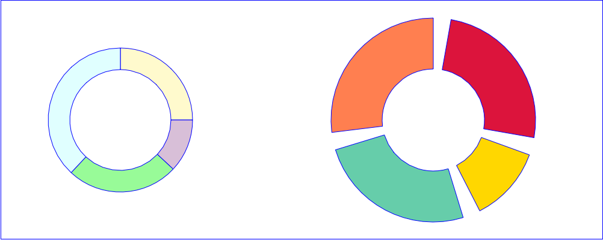
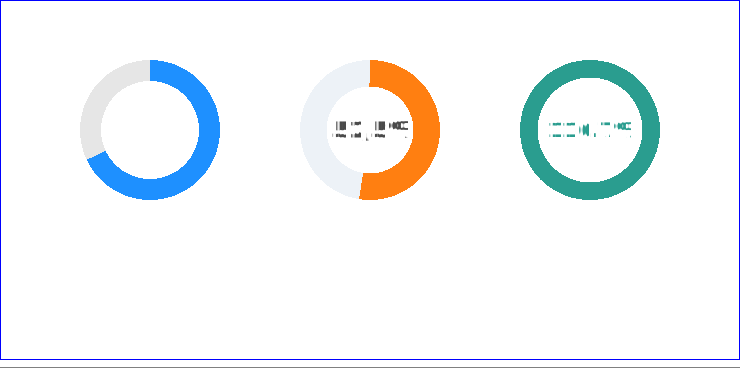

## chart

This class generates SVG graphics.

## Summary

This class extends the <a href="svg.md">`svg`</a>class

### ⚠️ Work in progress

|Function|Action|
|--------|------|
|.**pie** ( id :`Text` ; cx : `Real` ; cy : `Real` ; r : `Real` {; options : `Object`}) → `cs.chart` | Start a pie chart defined by its center `cx` `cy` and radius `r`. If `options.data` is empty or its total is `<= 0`, the function sets an explicit error and returns without drawing.|
|.**pieBounded** ( id :`Text` ; x : `Real` ; y : `Real` ; width : `Real` {; options : `Object`}) → `cs.chart` | Start a pie chart that fits into a square defined by the upper left corner `x` `y` and the side length `width`.|
|.**donut** ( id :`Text` ; cx : `Real` ; cy : `Real` ; r : `Real` {; thickness : `Real` {; margin : `Real` {; options : `Object`}}}) → `cs.chart` |  Start a donut chart defined by its center `cx` `cy`, radius `r`. `thickness` is stored as an inner radius percentage (0..100). If `<1`, it is interpreted as a ratio and converted to percent. Default is `0.7` (inner radius = 70% of radius, ring thickness = 30%). `margin` defines segment spacing. `options.span` can limit the donut to an arc in degrees (default `360`).| 
|.**donutBounded** ( id :`Text` ; x : `Real` ; y : `Real` ; width : `Real` ; options : `Object` ) → `cs.chart` |  Start a donut chart that fits into a square defined by the upper left corner `x` `y` and the side length `width`. Same `thickness`/`margin` behavior as `.donut()`.|
|.**semiDonut** ( id :`Text` ; cx : `Real` ; cy : `Real` ; r : `Real` {; thickness : `Real` {; margin : `Real` {; options : `Object`}}}) → `cs.chart` | Start a semi-donut chart (`span = 180`). Default origin is `-90` (top half).|
|.**semiDonutBounded** ( id :`Text` ; x : `Real` ; y : `Real` ; width : `Real` {; thickness : `Real` {; margin : `Real` {; options : `Object`}}}) → `cs.chart` | Start a semi-donut chart that fits into a square.|
|.**progressRing** ( id :`Text` ; cx : `Real` ; cy : `Real` ; r : `Real` ; value : `Real` ; max : `Real` {; options : `Object`} ) → `cs.chart` | Draws a single-value donut chart (progress ring). The ring is clamped to 0..100%. Supports track color, value color, origin, thickness, optional center label and font via options.|
|.**wedge**( id :`Text` ; percent : `Real`) → `cs.chart`|Draws a segment of the 360° percentage in a pie or donut chart. If the chart id is not found, an explicit error is pushed (`wedge(): chart id not found: ...`).|
|.**horizontlBar** ( id :`Text` ; x : `Real` ; y : `Real` ; width : `Real` ; height : `Real` {; options : `Object`}) → `cs.chart` | Start a vertical bar chart. `options.data` must be a collection of objects `{label, value, [color]}`.|
|.**verticalBar** ( id :`Text` ; x : `Real` ; y : `Real` ; width : `Real` ; height : `Real` {; options : `Object`}) → `cs.chart` | Start a vertical bar chart. `options.data` must be a collection of objects `{label, value, [color]}`.|
|.**closeChart**({id :`Text`})| Closing the chart `id` or the current chart|

### Notes

- In `.pie()`, non-positive values are ignored while filling slices.
- Error reporting favors explicit `_pushError(...)` messages instead of debug traces.
- For partial rings, percentages in `.wedge()` are relative to `options.span` (not always 360°).

## Examples

See the ***HDI Chart xxx*** methods

|  |  |
|:----|:----:|
|**Pie**||
|**Donut**||
|**progressRing**||

### Horizontal bar
```4D
var $chart:=cs:C1710.chart.new()
$chart.horizontalBar("myHBar"; 10; 10; 400; 200; {\
	data: [\
		{label: "A"; value: 120; color: "tomato"}; \
		{label: "B"; value: 80}; \
		{label: "C"; value: 200; color: "steelblue"}\
	]; \
	barGap: 0.2; \
	showValues: True; \
	axis: True \
})
$chart.preview()
```
<br>


----

### Vertical bar

```4D
var $chart:=cs:C1710.svgx.chart.new()
$chart.verticalBar("demo_vertical_bar"; 10; 10; 400; 300; {\
data: [\
{label: "Jan"; value: 120; color: "yellow"; stroke: True}; \
{label: "Feb"; value: 80; color: "tomato"}; \
{label: "Mar"; value: 200}; \
{label: "Apr"; value: 150}; \
{label: "May"; value: 180; stroke: "darkgreen"}; \
{label: "Jun"; value: 40}\
]; \
gap: 0.2; \
showValues: True; \
font: {style: Bold}; \
labels: {angle: -30; font: {size: 14; style: Bold}}; \
axis: True; \
horizontalGridLines: {unit: 40; color: "blue"}\
})
$chart.preview()
```
<br>


----

### Semi donut

```4D
var $chart:=cs.svgx.chart.new()

$chart.newCanvas({width: 680; height: 760; viewBox: "0 0 680 760"})

$chart.text("Répartition de la facture")\
.position(340; 52)\
.setAttribute("text-anchor"; "middle")\
.fontSize(44)\
.fontStyle(Bold)\
.fillColor("#163a7a")

var $thickness : Real:=0.62
var $margin : Integer:=2
var $radius : Real:=120

var $pink : Text:="#e63772"
var $green : Text:="#4f8b00"
var $orange : Text:="#f17d1f"
var $blue : Text:="#1271d5"

// 2025
$chart.semiDonut("bill_2025"; 190; 255; $radius; $thickness; $margin; {origin: -90})
$chart.wedge("bill_2025"; 34).fill($pink)
$chart.wedge("bill_2025"; 54).fill($green)
$chart.wedge("bill_2025"; 7).fill($orange)
$chart.wedge("bill_2025"; 5).fill($blue)
$chart.text("256 €").position(190; 125).setAttribute("text-anchor"; "middle").fontSize(40).fontStyle(Bold).fillColor("#2c4f95")
$chart.text("2025").position(190; 325).setAttribute("text-anchor"; "middle").fontSize(34).fontStyle(Bold).fillColor("#2c4f95")

// 2024
$chart.semiDonut("bill_2024"; 490; 255; $radius; $thickness; $margin; {origin: -90})
$chart.wedge("bill_2024"; 33).fill($pink)
$chart.wedge("bill_2024"; 56).fill($green)
$chart.wedge("bill_2024"; 6).fill($orange)
$chart.wedge("bill_2024"; 5).fill($blue)
$chart.text("247 €").position(490; 125).setAttribute("text-anchor"; "middle").fontSize(40).fontStyle(Bold).fillColor("#2c4f95")
$chart.text("2024").position(490; 325).setAttribute("text-anchor"; "middle").fontSize(34).fontStyle(Bold).fillColor("#2c4f95")

// 2023
$chart.semiDonut("bill_2023"; 340; 490; $radius; $thickness; $margin; {origin: -90})
$chart.wedge("bill_2023"; 35).fill($pink)
$chart.wedge("bill_2023"; 53).fill($green)
$chart.wedge("bill_2023"; 6).fill($orange)
$chart.wedge("bill_2023"; 6).fill($blue)
$chart.text("249 €").position(340; 360).setAttribute("text-anchor"; "middle").fontSize(40).fontStyle(Bold).fillColor("#2c4f95")
$chart.text("2023").position(340; 560).setAttribute("text-anchor"; "middle").fontSize(34).fontStyle(Bold).fillColor("#2c4f95")

// Legend line 1
$chart.rect(20; 20).position(160; 625).fill($pink)
$chart.text("Conso energie HT").position(190; 642).fontSize(18).fillColor("#1f376e")
$chart.rect(20; 20).position(370; 625).fill($green)
$chart.text("Abonnement HT").position(400; 642).fontSize(18).fillColor("#1f376e")

// Legend line 2
$chart.rect(20; 20).position(220; 680).fill($orange)
$chart.text("Taxe hors TVA").position(250; 697).fontSize(18).fillColor("#1f376e")
$chart.rect(20; 20).position(420; 680).fill($blue)
$chart.text("TVA").position(450; 697).fontSize(18).fillColor("#1f376e")

$chart.preview()
```
<br>


----
