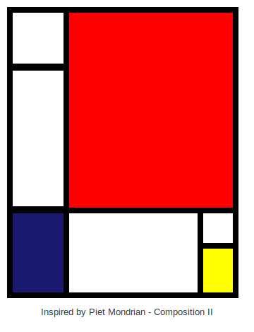
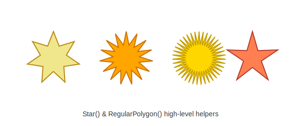
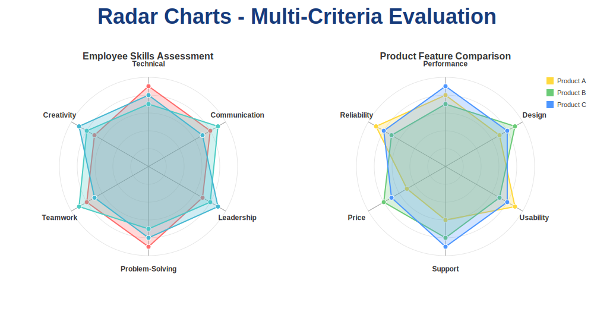
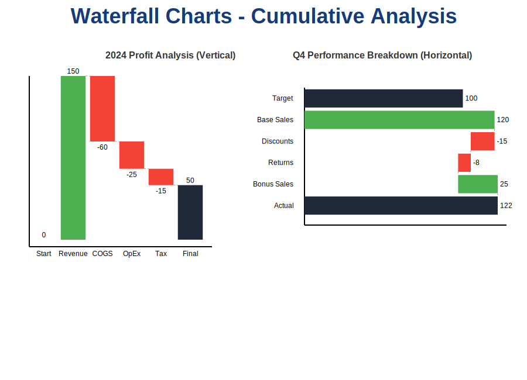
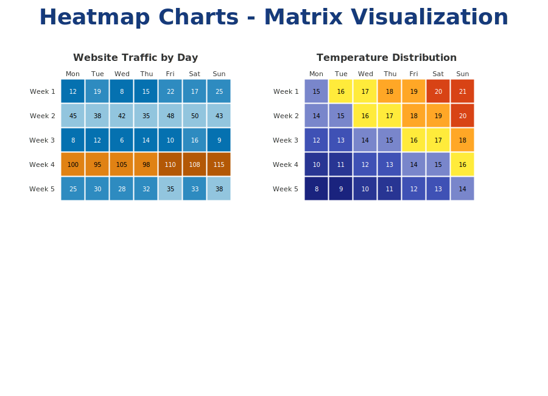
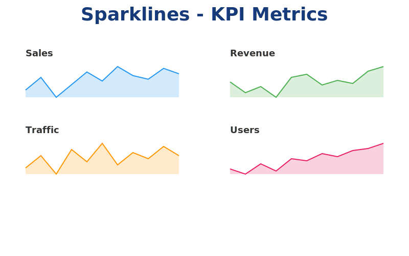
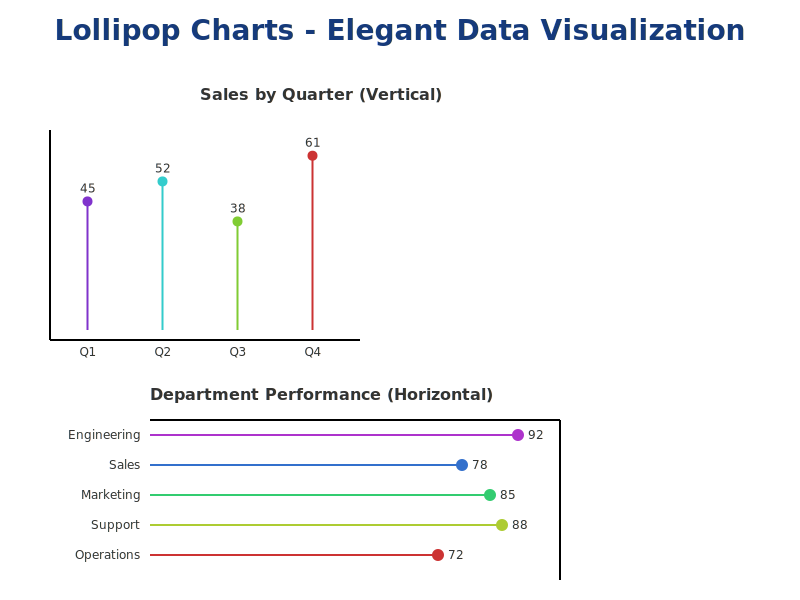
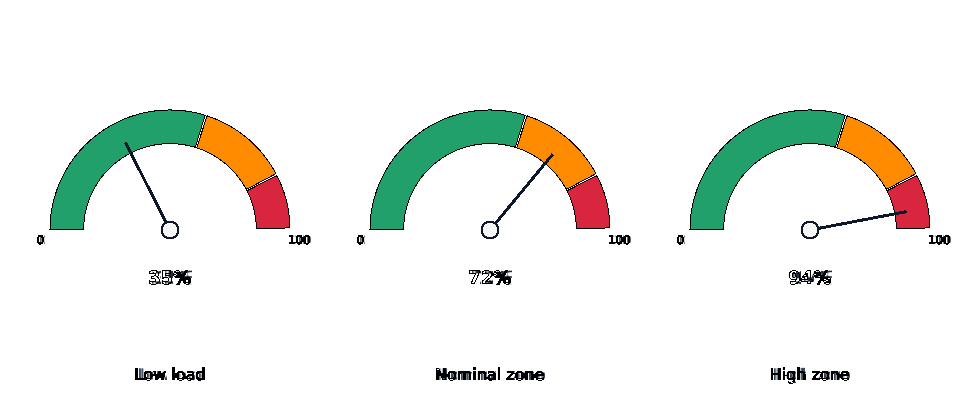
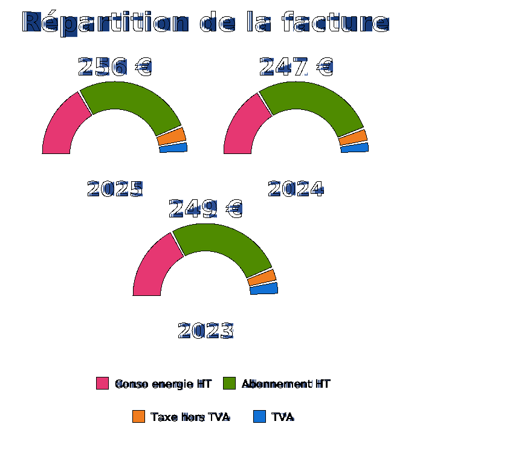

[](https://developer.4d.com) [](https://developer.4d.com/docs/Project/components/#loading-components)
<br>
[](https://developer.4d.com/)  [](https://github.com/vdelachaux/SVG-with-Classes/releases/latest) [](LICENSE) [](https://github.com/vdelachaux/SVG-with-Classes/actions/workflows/build.yml) 

# SVG with Classes

After creating and using the [4D SVG component](https://doc.4d.com/4Dv19/4D/19/4D-SVG-Component.100-5461938.en.html), I realized the need to create a more concise, faster, and SVG-like API for managing user interfaces and simplifying SVG image/document manipulation. The main goal was to reduce code complexity for SVG image/document creation and manipulation. 

* The `svg` class simplifies the creation and manipulation of the SVG elements thanks to a set of simple functions and some automatisms, and decrease the number of variables needed. 

* The `chart` class provides a growing collection of ready-to-use SVG chart types (bar, pie, donut, gauge, sparkline, lollipop, heatmap, radar, waterfall…). More could be done ;-)

For more details on properties and functions, see the class documentation:

* [svg class](Documentation/Classes/svg.md)
* [chart class](Documentation/Classes/chart.md)
* [color class](Documentation/Classes/color.md)
* [xml class](Documentation/Classes/xml.md)
* [font class](Documentation/Classes/font.md)
* [point class](Documentation/Classes/point.md)

The content will be augmented according to my needs but I strongly encouraged you to enrich this project through [pull request](https://github.com/vdelachaux/SVG-with-Classes/pulls). This can only benefit the [4D developer community](https://discuss.4d.com/search?q=4D%20for%20iOS). 

## Quick start

Create an `svg` object, draw with chainable commands, and preview it — no intermediate variables needed:

```4D
var $svg:=cs.svgx.svg.new()

$svg.group("mondrian").stroke(4).translate(10; 10).scale(2)
$svg.rect(40; 60).position(2; 144).fill("midnightblue")
$svg.rect(120; 142).position(42; 2).fill("red")
$svg.group().fill("white")
$svg.rect(40; 40).position(2; 2)
$svg.rect(40; 100).position(2; 43)
$svg.rect(95; 60).position(42; 144)
$svg.rect(25; 25).position(137; 144)
$svg.rect(25; 35).position(137; 169).fill("yellow")

$svg.preview()  // open the result in the SVG viewer
```
<br>


The `Test SVG` project bundles dozens of such runnable examples as **HDI** (“How Do I”) methods — just open one and run it.

## Gallery

A few examples of what the `svg` and `chart` classes can produce (see the matching `HDI …` methods in the `Test SVG` project):

<table>
  <tr>
    <td align="center"><br><sub>Star() &amp; RegularPolygon()</sub></td>
    <td align="center"><br><sub>Radar</sub></td>
  </tr>
  <tr>
    <td align="center"><br><sub>Waterfall</sub></td>
    <td align="center"><br><sub>Heatmap</sub></td>
  </tr>
  <tr>
    <td align="center"><br><sub>Sparkline</sub></td>
    <td align="center"><br><sub>Lollipop</sub></td>
  </tr>
  <tr>
    <td align="center"><br><sub>Circular gauge</sub></td>
    <td align="center"><br><sub>Semi-donut</sub></td>
  </tr>
</table>

See the [chart class documentation](Documentation/Classes/chart.md) for the full list and the code behind each example.

## Repository structure

The repository holds, at its root, the **component source project** (a 4D project) and, in a dedicated folder, a **test project** with runnable examples.

```
SVG-with-Classes/
├── BUILD/                         Built & signed component (binary, ready to deploy)
├── Project/                       Component source — 4D project
│   └── Sources/
│       └── Classes/               Class sources
│           ├── svg.4dm            SVG creation / manipulation API
│           ├── chart.4dm          Chart types (bar, pie, donut, radar, waterfall…)
│           ├── color.4dm          Color conversions & palettes (RGB/HSL/CSS)
│           ├── font.4dm           Font helper
│           ├── point.4dm          2D point helper
│           └── xml.4dm            Low-level XML helper
├── Documentation/
│   └── Classes/                   Markdown docs (svg, chart, color, xml) + chart illustrations
├── Resources/                     Component resources (colors.json, logos…)
├── Settings/                      Build settings (buildApp, backup)
└── Test SVG/                      Test project & runnable examples
    └── Project/
        └── Sources/
            └── Methods/           “HDI …” (How Do I) demo methods, one per feature
                                   e.g. HDI Chart radar, HDI Chart waterfall,
                                        HDI Gradient linear, HDI Filter blur…
```

> The component is developed and built from the root 4D project (`Project/`).
> The `Test SVG` project loads the component and exposes one **HDI** (“How Do I”) method per feature, ideal to discover the API by example.


# <a name="installation">Installation</a>

## 

The component is compatible with the [Project Dependencies](https://developer.4d.com/docs/Project/components#monitoring-project-dependencies) feature. You can easily integrate it into your project by selecting Design > Project Dependencies and adding `vdelachaux/SVG-with-Classes` as the repository address in the dedicated dialog box. I suggest setting the rule to “Follow 4D version.”  **This way, you can benefit from updates over time.**

## Binary databases

Download the component to the `BUILD` folder corresponding to your version of 4D and place it in a `Component` folder near your `.4DB`file.

# <a name="improvments">Improvements and bug fixes</a>

* If you encountered a bug or have a feature request, feel free to create an issue.
However, it is highly appreciated if you [browse and search current issues](https://github.com/vdelachaux/SVG-with-Classes/issues) first.
Found the issue? Go on and join its discussion thread.
Not found? Go on and [create one](https://github.com/vdelachaux/SVG-with-Classes/issues/new).

* We welcome contributions to this repository! To contribute, please follow these steps:

	1. [Fork the repository](https://docs.github.com/en/repositories/creating-and-managing-repositories/cloning-a-repository).
	2. Create a new branch:
	    ```$
	    git checkout -b my-feature-branch
	    ```
	3. Make your changes and commit them:
	    ```$
	    git commit -m "Add my feature"
	    ```
	4. Push to the branch:
	    ```$
	    git push origin my-feature-branch
	    ```
	5. [Create a pull request](https://docs.github.com/en/pull-requests/collaborating-with-pull-requests/proposing-changes-to-your-work-with-pull-requests/about-pull-requests).
	
	For more details, please refer to our [contributing guidelines](CONTRIBUTING.md).

## License

`SVG with Classes` is licensed under the MIT License See the [LICENSE](./LICENSE) file for more details.

## Contact
For any questions or inquiries, please contact the repository owner [@vdelachaux](https://github.com/vdelachaux).

----
`Enjoy the 4th dimension`
